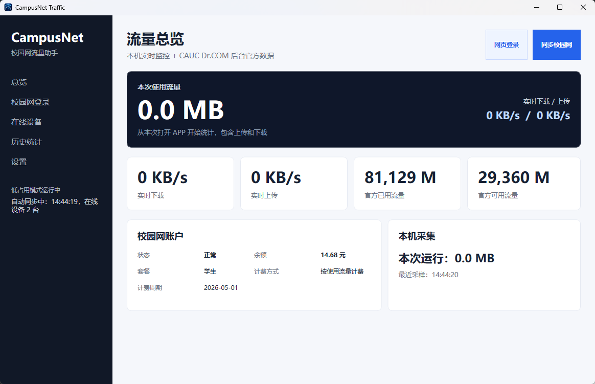

# CampusNetTraffic

CampusNetTraffic 是一个面向 Windows 的校园网流量助手，主要用于查看本机网络流量、同步校园网后台数据，并管理在线设备。

它的目标很直接：把校园网登录、流量查看、在线设备管理这些常用操作集中到一个轻量桌面程序里。

## 功能

- WPF 桌面界面，适合 Windows 日常使用
- 实时显示本机下载/上传速度
- 统计本次运行期间的总流量
- 使用 SQLite 保存本地采样数据
- 内嵌 WebView2 登录校园网后台
- 自动复用登录会话，减少重复登录
- 同步校园网后台的已用流量、可用流量、账户余额、套餐和计费周期
- 查看当前在线设备列表
- 支持注销在线设备
- 支持开机自启
- 支持托盘图标显示实时速率

## 适用场景

- 想快速查看自己当前网速和流量消耗
- 想把校园网后台常用信息集中到一个桌面程序里
- 想方便管理当前在线设备

## 项目截图

后续可以在这里放程序主界面、登录页、流量统计和在线设备列表的截图。

```text

```

## 运行环境

- Windows 10 / 11
- .NET 8 Windows
- WebView2 Runtime

## 使用方式

1. 打开程序
2. 点击“网页登录”并在内嵌页面完成校园网登录
3. 登录成功后点击“同步校园网”
4. 之后可以直接查看流量、余额、套餐和在线设备

## 发布说明

如果你从 GitHub Releases 下载，通常只需要解压后运行生成的主程序即可。若你自己本地发布，可以使用下面的命令：

```powershell
dotnet publish -c Release -r win-x64 --self-contained true -p:PublishSingleFile=true -p:IncludeNativeLibrariesForSelfExtract=true -o dist
```

发布完成后，主要入口文件一般在：

```text
dist\CampusNetTraffic.exe
```

## GitHub Releases 建议

你上传到 GitHub 时，建议至少提供下面这些内容：

- `CampusNetTraffic-win-x64.zip`：发布后的完整压缩包
- `README.md`：项目说明
- `Release notes`：简单写清楚本次更新内容

可以直接使用下面这段作为 Releases 说明：

```text
CampusNetTraffic Windows 发布版

使用方法：
1. 下载并解压压缩包
2. 运行 CampusNetTraffic.exe
3. 使用校园网账号登录后点击“同步校园网”

注意：程序仅适用于 Windows。
```

## 开发

```powershell
dotnet build
dotnet run
```

## 项目说明

这个项目当前主要面向 CAUC 校园网环境，相关登录页和后台数据同步逻辑已经针对该场景实现。

## 计划中

- 每日 / 每月统计聚合
- 登录状态自动检测
- 掉线提醒
- 更完整的安装包
